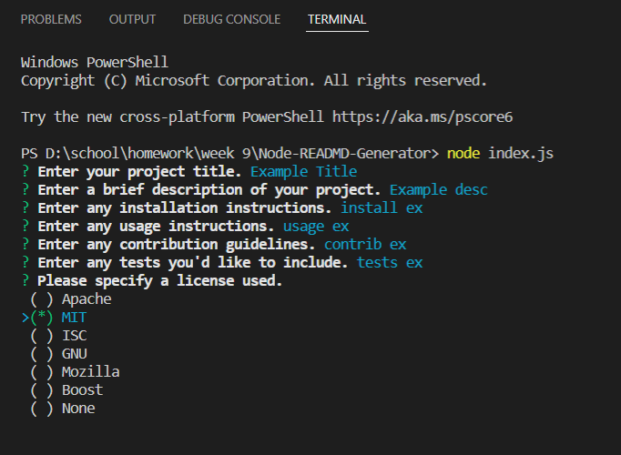
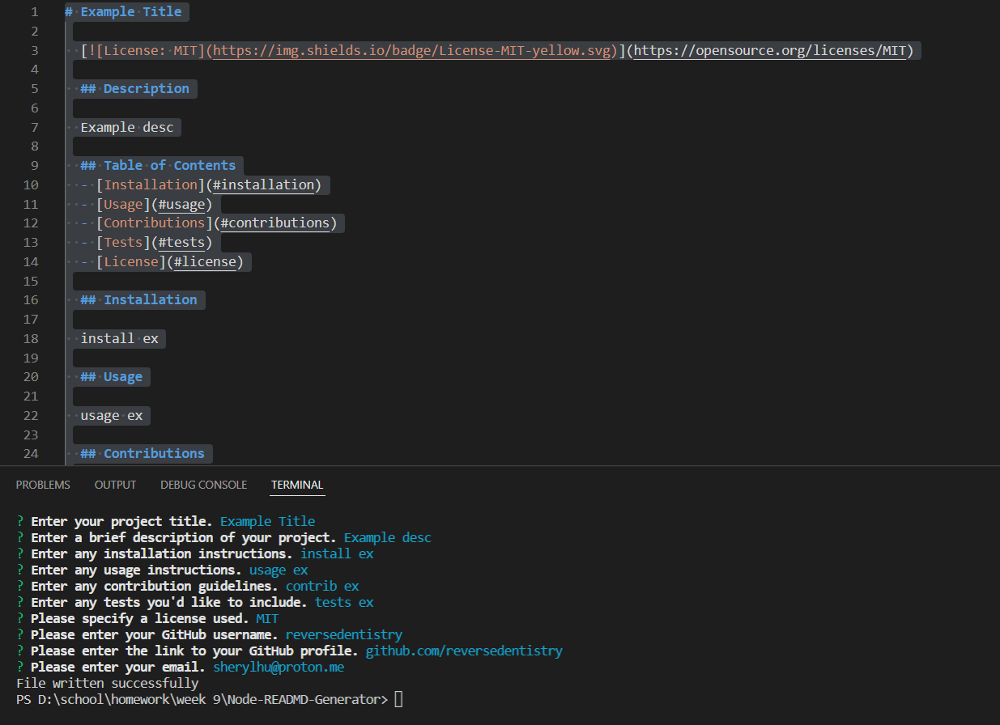

# README Generator

## Description

README files are essential to programs and apps in order to convey information about themselves to users who aren't the developers. However, they can be tedious to make from scratch every time. Luckily, the contents of good READMEs can be formulaic. This program makes the process simpler by generating a README using premade prompts that take user input. 

## Table of Contents
- [Installation](#installation)
- [Usage](#usage)
- [License](#license)
- [Contact Me](#author)

## Installation

1. Make sure you have Node.js installed. 
2. Open your chosen terminal. Enter this to download and install the needed modules.
`npm i`

## Usage

1. Once everything required is installed, enter this into the terminal to start the program: 
`node index.js`
2. Answer the prompts as they display. To move on to the next prompts, hit enter. Some prompts require input before they will progress to the next. For prompts that require a choice from a checklist, use the arrow keys to move between choices and use the spacebar to make your selection. 
3. Should the file be written successfully, navigate to the "generated" folder to find the final README product. 

[Watch a demo video.](https://youtu.be/GD3SqUMoOc0)

### Screenshots

## License 

 This project is [MIT](https://choosealicense.com/licenses/mit/) licensed.

## Author
- GitHub: [reversedentistry](github.com/reversedentistry) 
- Email: sherylhu@proton.me